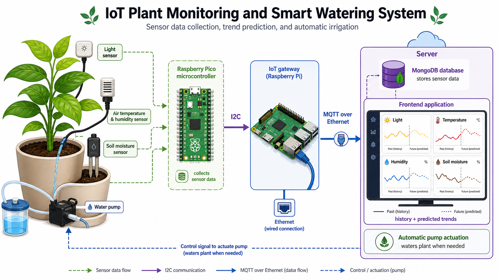

DHT11 
Our project is an IoT-based monitoring and control system for plants. It collects environmental and soil data, sends them to an IoT gateway, predicts future parameter trends, and controls a watering pump when irrigation is needed.

The system measures three main parameters:

- Light intensity
- Air temperature and humidity
- Soil moisture

These data are acquired by a Raspberry Pi Pico microcontroller. The Pico reads the light intensity from a BH1750 sensor over I2C, reads air temperature and humidity from a DHT11 sensor, and reads soil moisture through its ADC input. The soil moisture voltage is converted into a percentage value using a calibration function based on dry-soil and wet-soil reference voltages.

The Raspberry Pi Pico uses two different I2C roles. It works as an I2C master when communicating with the BH1750 light sensor, and as an I2C slave when communicating with the Raspberry Pi gateway. The gateway reads a 16-byte data packet from the Pico at I2C slave address 0x17. This packet contains four integer values:

- Light level
- Air temperature
- Air humidity
- Soil moisture percentage

The system also includes a pump as the actuator. The pump is connected to the Pico through a GPIO output. The Raspberry Pi gateway can control the pump by sending a command to the Pico over the same I2C channel. When the Pico receives the actuator command, it switches the pump on or off.

After reading the data from the Pico, the Raspberry Pi acts as the IoT gateway. It sends the collected measurements to the server using MQTT over an Ethernet connection. The server stores the received data in a MongoDB database.

The frontend application displays the monitored parameters and allows the user to view the history of each value. It also shows possible future values predicted by the system, making it possible to monitor plant conditions and support automatic watering decisions.